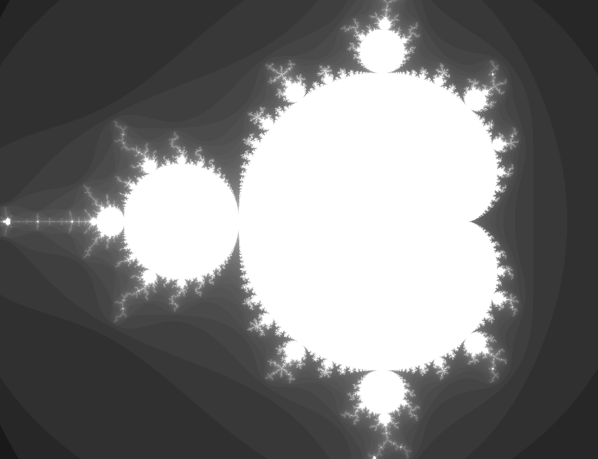

# mandelbruht

A real-time, GPU-accelerated [Mandelbrot set](https://en.wikipedia.org/wiki/Mandelbrot_set) explorer built with [Rust](https://www.rust-lang.org/) and the [Bevy](https://bevyengine.org/) game engine.

The fractal is rendered entirely on the GPU via a custom WGSL shader, so panning and zooming run smoothly in real time.


## Controls

| Key         | Action     |
| ----------- | ---------- |
| `W` / `S`   | Pan up / down |
| `A` / `D`   | Pan left / right |
| `E`         | Zoom in    |
| `Q`         | Zoom out   |
| `Esc`       | Exit       |

> Panning speed scales with the current zoom level, so navigation feels consistent whether you're viewing the whole set or deep inside it.

## Getting started

### Prerequisites

Check prerequisites for [bevy](https://bevy.org/) game engine

### Run

```sh
cargo run
```

This launches a window with the Mandelbrot set centered at `(-0.5, 0.0)`.

## Project structure

```
mandelbruht/
├── src/
│   └── main.rs                    # App setup, material, camera & input handling
├── assets/
│   └── shaders/
│       └── mandel.wgsl            # Fragment shader: the actual fractal math
└── Cargo.toml
```

## How it works

### The fractal math

For each pixel we map its UV coordinates into the complex plane, then iterate the classic Mandelbrot recurrence:

```
z₀ = 0
zₙ₊₁ = zₙ² + c
```

A point `c` belongs to the set if the sequence stays bounded; in practice we stop once `|z|² > 4` (the point is guaranteed to escape) or after a maximum iteration count. The shader does this in a loop:

```wgsl
var z = vec2<f32>(0.0);
var i = 0u;
while (f32(i) < MAX_ITER && dot(z, z) <= 4.0) {
    z = vec2<f32>(z.x * z.x - z.y * z.y, 2.0 * z.x * z.y) + c;
    i = i + 1u;
}
```

The normalized iteration count `t = i / MAX_ITER` becomes the pixel brightness: points inside the set render bright, while points that escape quickly render dark.

### Camera state as a uniform

The whole camera is packed into a single `vec4` uniform on a custom `Material2d`:

| Component | Meaning         |
| --------- | --------------- |
| `view.xy` | Center of the view (complex-plane coordinate) |
| `view.z`  | Zoom factor     |
| `view.w`  | Maximum iterations |

```rust
#[derive(Asset, Clone, Debug, TypePath, AsBindGroup)]
struct MandelbrotMaterial {
    #[uniform(0)]
    view: Vec4,
}
```

The `controls` system updates this uniform every frame in response to `W`/`A`/`S`/`D` (pan) and `Q`/`E` (zoom).
